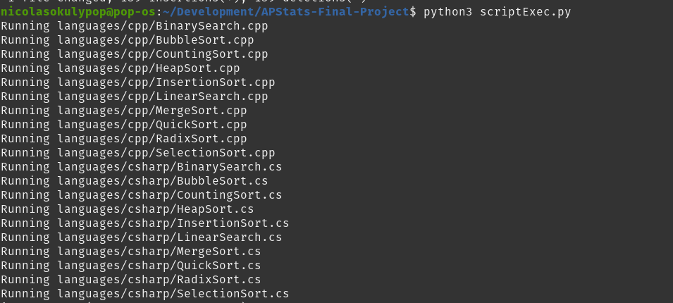
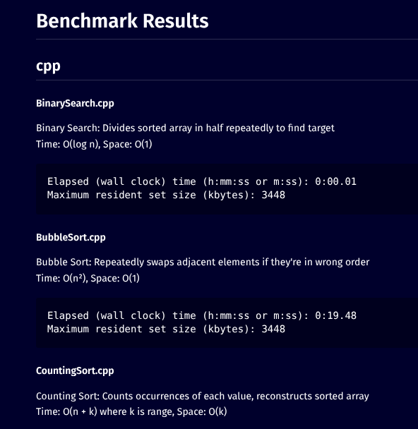
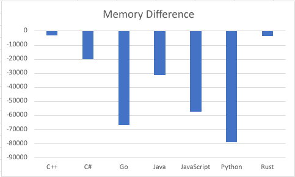
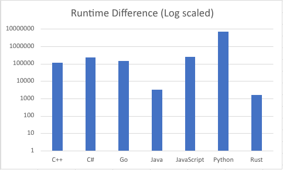

# Mean Difference Between Predicted and Actual Algorithm Performance Across Programming Languages

#### Nicolas Okuly - May 12th, 2026

## Introduction

Different programming languages can have different runtime and memory performance, even when running the same algorithm. This study asks whether the actual performance of an algorithm differs from its expected Big O-based prediction, and whether that difference changes across programming languages.

The goal is not to force the data into a chi-square test. Since runtime and memory are continuous measurements, this study will focus on mean differences between predicted and observed values.

Big O notation describes how an algorithm is expected to scale. For example, if an algorithm is expected to grow linearly, then doubling the input size should roughly double the work required. In practice, the real measured runtime or memory may not match that prediction exactly.

I will run several sorting and search algorithms in multiple programming languages and collect time and memory data. For each language, I will run each algorithm 5 times and calculate the mean observed value. Then I will compare that mean to the predicted value and compute the difference. I will do this for every algorithm and then find the overall mean difference for each programming language.

This will give me a single true mean difference value for each language that shows how far the observed performance is from the predicted performance.

To keep the study structured, I will use the following algorithms and languages.

<table style="margin: 0 auto">
	<tr>
		<td valign="top">
            <table>
                <tr>
                    <th>#</th>
                    <th>Algorithm</th>
                    <th>Big O Notation</th>
                </tr>
                <tr><td>1</td><td>Linear search</td><td>O(n)</td></tr>
                <tr><td>2</td><td>Binary search</td><td>O(log n)</td></tr>
                <tr><td>3</td><td>Bubble sort</td><td>O(n²)</td></tr>
                <tr><td>4</td><td>Selection sort</td><td>O(n²)</td></tr>
                <tr><td>5</td><td>Insertion sort</td><td>O(n²)</td></tr>
                <tr><td>6</td><td>Merge sort</td><td>O(n log n)</td></tr>
                <tr><td>7</td><td>Quick sort</td><td>O(n log n) average, O(n²) worst</td></tr>
                <tr><td>8</td><td>Heap sort</td><td>O(n log n)</td></tr>
                <tr><td>9</td><td>Counting sort</td><td>O(n + k)</td></tr>
                <tr><td>10</td><td>Radix sort</td><td>O(d * (n + k))</td></tr>
            </table>
		</td>
        <!---->
		<td valign="top">
            <table>
                <tr>
                    <th>#</th>
                    <th>Language</th>
                </tr>
                <tr><td>1</td><td>Python</td></tr>
                <tr><td>2</td><td>Java</td></tr>
                <tr><td>3</td><td>C++</td></tr>
                <tr><td>4</td><td>JavaScript</td></tr>
                <tr><td>5</td><td>C#</td></tr>
                <tr><td>6</td><td>Go</td></tr>
                <tr><td>7</td><td>Rust</td></tr>
            </table>
		</td>
	</tr>
</table>

Because this creates a large number of comparisons, I will keep the input sizes and trial conditions consistent across every language and algorithm.

The command used to track time and memory is as follows:

```bash
/usr/bin/time -v [command]
```

The output looks like the following:

```txt
User time (seconds): 0.01
System time (seconds): 0.00
Percent of CPU this job got: 92%
Elapsed (wall clock) time (h:mm:ss or m:ss): 0:00.02
Average shared text size (kbytes): 0
Average unshared data size (kbytes): 0
Average stack size (kbytes): 0
Average total size (kbytes): 0
Maximum resident set size (kbytes): 8348
Average resident set size (kbytes): 0
Major (requiring I/O) page faults: 0
Minor (reclaiming a frame) page faults: 800
Voluntary context switches: 1
Involuntary context switches: 1
Swaps: 0
File system inputs: 0
File system outputs: 0
Socket messages sent: 0
Socket messages received: 0
Signals delivered: 0
Page size (bytes): 4096
Exit status: 0
```

The values I am interested in is "Elapsed (wall clock) time (h:mm:ss or m:ss)" as the time statistic, and "Maximum resident set size (kbytes)" as the memory statistic.

## Data Collection

### System Requirements (Debian/Linux)

```bash
sudo apt install g++ mono-mcs default-jdk golang rustc nodejs python3
```



<br>



### Test Data - n = 100,000

Dataset is in dataset.txt.

All data will be stored in /languages/DATA.md

For the estimates below, I used `k = 199` from the dataset range and `d = 3` decimal digits for radix sort.

## Actual Values

The table below shows the actual mean runtime and memory values from the benchmark data.

| Language   | Average Runtime | Average Memory |
| ---------- | --------------: | -------------: |
| C++        |           3.952 |         3954.0 |
| C#         |           7.440 |        25440.0 |
| Go         |           4.843 |        83724.0 |
| Java       |           0.108 |        39488.0 |
| JavaScript |           8.387 |        71933.2 |
| Python     |         226.693 |        99020.8 |
| Rust       |           0.055 |         4567.2 |

<details>
<summary>Show the actual-value average calculations</summary>

### C++

```math
(0.01 + 19.48 + 0.03 + 0.03 + 3.93 + 0.00 + 0.05 + 0.03 + 0.03 + 15.93) / 10 = 3.952
```

```math
(3448 + 3448 + 7672 + 3444 + 3448 + 3464 + 3832 + 3448 + 3900 + 3436) / 10 = 3954.0
```

### C#

```math
(0.10 + 46.64 + 0.14 + 0.15 + 11.43 + 0.04 + 0.15 + 0.05 + 0.06 + 15.64) / 10 = 7.440
```

```math
(16640 + 26232 + 31492 + 26356 + 26200 + 16448 + 28788 + 26332 + 29552 + 26360) / 10 = 25440.0
```

### Go

```math
(1.22 + 24.07 + 1.10 + 1.32 + 4.94 + 1.18 + 1.14 + 1.05 + 1.27 + 11.14) / 10 = 4.843
```

```math
(84392 + 81816 + 85332 + 83224 + 83160 + 82268 + 83924 + 81944 + 85976 + 85204) / 10 = 83724.0
```

### Java

```math
(0.12 + 0.10 + 0.11 + 0.11 + 0.09 + 0.12 + 0.10 + 0.10 + 0.11 + 0.12) / 10 = 0.108
```

```math
(39512 + 39504 + 39320 + 39576 + 39400 + 39528 + 39328 + 39588 + 39524 + 39600) / 10 = 39488.0
```

### JavaScript

```math
(0.32 + 35.73 + 0.58 + 0.48 + 9.32 + 0.40 + 0.69 + 0.66 + 0.40 + 35.29) / 10 = 8.387
```

```math
(56344 + 68252 + 76036 + 66180 + 64416 + 56032 + 83240 + 109848 + 69712 + 69272) / 10 = 71933.2
```

### Python

```math
(0.53 + 1095.36 + 1.10 + 1.15 + 641.34 + 0.66 + 1.08 + 1.01 + 1.10 + 523.60) / 10 = 226.693
```

```math
(96636 + 96604 + 120432 + 96616 + 96648 + 96436 + 96764 + 96712 + 96700 + 96660) / 10 = 99020.8
```

### Rust

```math
(0.01 + 0.17 + 0.05 + 0.04 + 0.02 + 0.00 + 0.04 + 0.03 + 0.03 + 0.16) / 10 = 0.055
```

```math
(3636 + 3096 + 11420 + 3228 + 3232 + 3104 + 3740 + 3256 + 3704 + 3256) / 10 = 4567.2
```

</details>

The table below converts the n=1 baselines into projected estimates using each algorithm's Big O class.

| Language   | Estimated Runtime | Estimated Memory |
| ---------- | ----------------: | ---------------: |
| C++        |        118581.672 |          792.463 |
| C#         |        223240.799 |         5098.700 |
| Go         |        145316.558 |        16780.015 |
| Java       |          3240.592 |         7914.209 |
| JavaScript |        251655.992 |        14416.896 |
| Python     |       6802033.117 |        19845.809 |
| Rust       |          1650.302 |          915.361 |

<details>
<summary>Show the full calculation work</summary>

### C++

```math
0.00003952 \times \frac{100000 + \log_2(100000) + 100000^2 + 100000^2 + 100000^2 + 100000 \log_2(100000) + 100000 \log_2(100000) + 100000 \log_2(100000) + (100000 + 199) + 3(100000 + 199)}{10} = 118581.672
```

```math
0.03954 \times \frac{1 + 1 + 1 + 1 + 1 + 100000 + \log_2(100000) + 1 + 199 + (100000 + 199)}{10} = 792.463
```

### C#

```math
0.0000744 \times \frac{100000 + \log_2(100000) + 100000^2 + 100000^2 + 100000^2 + 100000 \log_2(100000) + 100000 \log_2(100000) + 100000 \log_2(100000) + (100000 + 199) + 3(100000 + 199)}{10} = 223240.799
```

```math
0.2544 \times \frac{1 + 1 + 1 + 1 + 1 + 100000 + \log_2(100000) + 1 + 199 + (100000 + 199)}{10} = 5098.700
```

### Go

```math
0.00004843 \times \frac{100000 + \log_2(100000) + 100000^2 + 100000^2 + 100000^2 + 100000 \log_2(100000) + 100000 \log_2(100000) + 100000 \log_2(100000) + (100000 + 199) + 3(100000 + 199)}{10} = 145316.558
```

```math
0.83724 \times \frac{1 + 1 + 1 + 1 + 1 + 100000 + \log_2(100000) + 1 + 199 + (100000 + 199)}{10} = 16780.015
```

### Java

```math
0.00000108 \times \frac{100000 + \log_2(100000) + 100000^2 + 100000^2 + 100000^2 + 100000 \log_2(100000) + 100000 \log_2(100000) + 100000 \log_2(100000) + (100000 + 199) + 3(100000 + 199)}{10} = 3240.592
```

```math
0.39488 \times \frac{1 + 1 + 1 + 1 + 1 + 100000 + \log_2(100000) + 1 + 199 + (100000 + 199)}{10} = 7914.209
```

### JavaScript

```math
0.00008387 \times \frac{100000 + \log_2(100000) + 100000^2 + 100000^2 + 100000^2 + 100000 \log_2(100000) + 100000 \log_2(100000) + 100000 \log_2(100000) + (100000 + 199) + 3(100000 + 199)}{10} = 251655.992
```

```math
0.719332 \times \frac{1 + 1 + 1 + 1 + 1 + 100000 + \log_2(100000) + 1 + 199 + (100000 + 199)}{10} = 14416.896
```

### Python

```math
0.00226693 \times \frac{100000 + \log_2(100000) + 100000^2 + 100000^2 + 100000^2 + 100000 \log_2(100000) + 100000 \log_2(100000) + 100000 \log_2(100000) + (100000 + 199) + 3(100000 + 199)}{10} = 6802033.117
```

```math
0.990208 \times \frac{1 + 1 + 1 + 1 + 1 + 100000 + \log_2(100000) + 1 + 199 + (100000 + 199)}{10} = 19845.809
```

### Rust

```math
0.00000055 \times \frac{100000 + \log_2(100000) + 100000^2 + 100000^2 + 100000^2 + 100000 \log_2(100000) + 100000 \log_2(100000) + 100000 \log_2(100000) + (100000 + 199) + 3(100000 + 199)}{10} = 1650.302
```

```math
0.045672 \times \frac{1 + 1 + 1 + 1 + 1 + 100000 + \log_2(100000) + 1 + 199 + (100000 + 199)}{10} = 915.361
```

</details>

The table below shows the difference between the estimated and actual values.

| Language   | Runtime Difference | Memory Difference |
| ---------- | -----------------: | ----------------: |
| C++        |         118577.720 |         -3161.537 |
| C#         |         223233.359 |        -20341.300 |
| Go         |         145311.715 |        -66943.985 |
| Java       |           3240.484 |        -31573.791 |
| JavaScript |         251647.605 |        -57516.304 |
| Python     |        6801806.424 |        -79174.991 |
| Rust       |           1650.247 |         -3651.839 |

## Data Graphs and Summary Statistics

### Difference in memory



### Difference in runtime



## Statistical Analysis

For each language, compute the 10 paired differences (estimated runtime/memory minus actual runtime/memory) across the 10 algorithms. I will use a **one-sample t-test** on these differences to test:

- **Null Hypothesis (H₀):** The mean difference = 0 (estimates match actuals on average)
- **Alternative Hypothesis (Hₐ):** The mean difference ≠ 0 (estimates systematically differ from actuals)

I will report the mean difference, standard deviation of differences, t-statistic, and a **95% t confidence interval** for the mean difference for each language. This directly tests the difference in means to determine whether the Big O model accurately predicts actual performance.

**Disclaimer: these results should be interpreted with caution because the one-sample t-test conditions are not fully met. The sample size is small, the languages are not a random sample, and the runtime data in particular is strongly right-skewed with an extreme outlier, so the t-based results are only approximate.**

---

### Runtime Calculations

#### Number Summary Runtime (n=7)

| Min      | Q1       | Median   | Q3       | Max         | Mean    | StdDev  |
| -------- | -------- | -------- | -------- | ----------- | ------- | ------- |
| 1650.247 | 3240.484 | 145311.7 | 251647.6 | 6801806.424 | 1077924 | 2525849 |

#### One-sample t-test for a mean

| H0    | Ha    | x̄       | s       | n   | α    | t-stat   | p-value   | df  |
| ----- | ----- | ------- | ------- | --- | ---- | -------- | --------- | --- |
| μ = 0 | μ ≠ 0 | 1077924 | 2525849 | 7   | 0.05 | 1.129093 | 0.3019695 | 6   |

#### One-same t-interval for a mean

| x̄       | s       | n   | Confidence level | t\*      | SE       | ME      | df  | Interval            |
| ------- | ------- | --- | ---------------- | -------- | -------- | ------- | --- | ------------------- |
| 1077924 | 2525849 | 7   | 0.95             | 2.446912 | 954681.1 | 2336021 | 6   | (-1258097, 3413945) |

Conclusion: the runtime test is not significant at $\alpha = 0.05$, so there is not enough evidence that the mean runtime difference is different from 0. The 95% confidence interval includes 0, which matches that result.

How they relate: for a two-sided test, a 95% confidence interval that contains 0 corresponds to failing to reject $H_0$ at the 0.05 level.

---

### Memory Calculations

#### Number Summary Memory (n=7)

| Min       | Q1        | Median    | Q3        | Max       | Mean      | StdDev  |
| --------- | --------- | --------- | --------- | --------- | --------- | ------- |
| -79174.99 | -66943.99 | -31573.79 | -3651.839 | -3161.537 | -37480.54 | 30710.4 |

#### One-sample t-test for a mean

| H0    | Ha    | x̄         | s       | n   | α    | t-stat   | p-value    | df  |
| ----- | ----- | --------- | ------- | --- | ---- | -------- | ---------- | --- |
| μ = 0 | μ ≠ 0 | -37480.54 | 30710.4 | 7   | 0.05 | -3.22901 | 0.01793279 | 6   |

#### One-same t-interval for a mean

| x̄         | s       | n   | Confidence level | t\*      | SE       | ME       | df  | Interval              |
| --------- | ------- | --- | ---------------- | -------- | -------- | -------- | --- | --------------------- |
| -37480.54 | 30710.4 | 7   | 0.95             | 2.446912 | 11607.44 | 28402.38 | 6   | (-65882.92, -9078.16) |

Conclusion: the memory test is significant at $\alpha = 0.05$, so there is evidence that the mean memory difference is not 0. The 95% confidence interval stays entirely below 0, which indicates the mean difference is negative.

How they relate: for a two-sided test, a 95% confidence interval that does not contain 0 corresponds to rejecting $H_0$ at the 0.05 level.

## Conclusion

Overall, the memory data provides evidence that the mean difference between predicted and actual values is not 0, because the p-value is below 0.05 and the 95% confidence interval does not include 0. The runtime data does not provide enough evidence of a mean difference, because the p-value is above 0.05 and the interval includes 0.

### Possible Errors

For runtime, a Type II error would mean concluding there is no real average difference when one actually exists. For memory, a Type I error would mean concluding there is a real average difference when the true mean difference is actually 0.

### Limitations

This study has a small sample size of 7 languages, and the languages were not randomly selected. The runtime data is also strongly skewed with an extreme outlier, so the t-based methods are only approximate. In addition, the estimated values are based on a Big O model with simplifying assumptions, so the predictions are not exact measurements.

### Improvements Next Time

Next time, I would collect more languages or more repeated trials, use a random or more representative sample of languages, and separate the analysis into runtime and memory more carefully. I would also keep the measurement conditions more consistent and record more detailed data so the predicted values can be compared with less noise.
